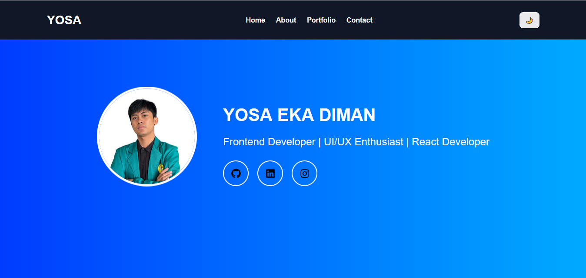
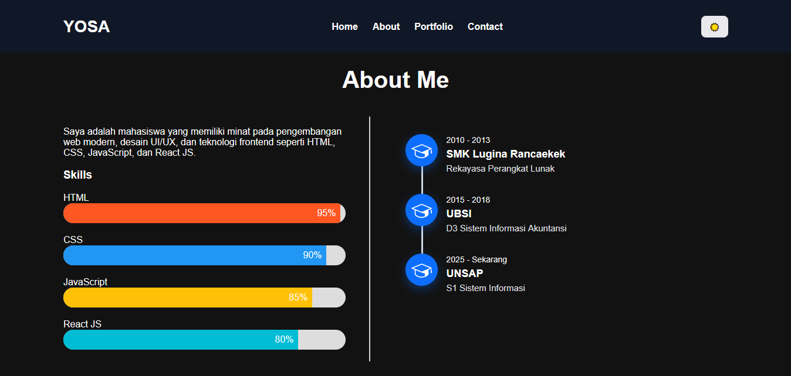
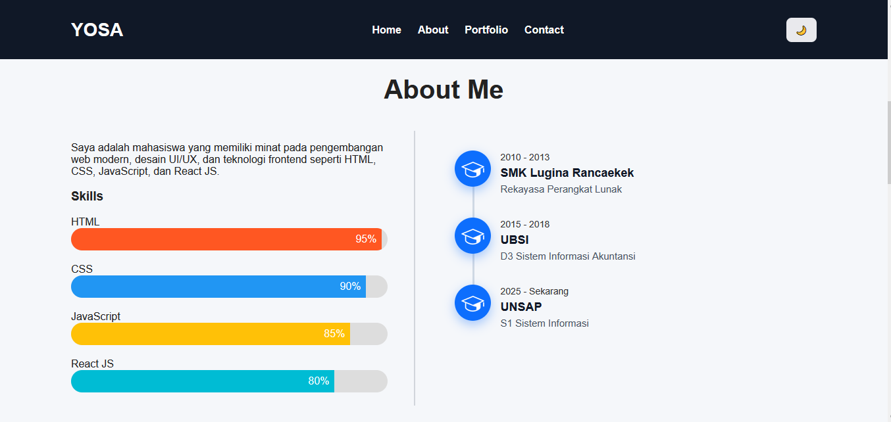
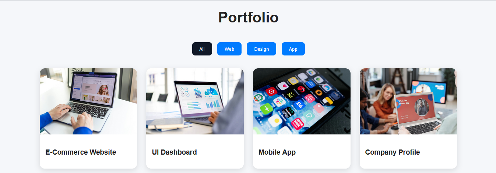
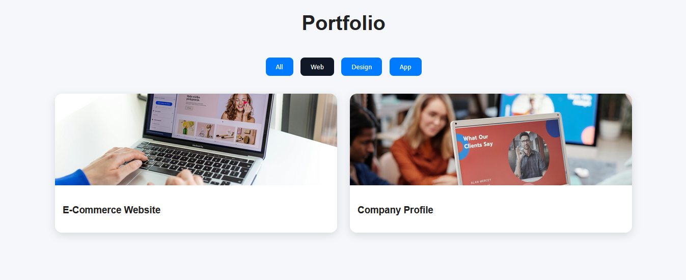
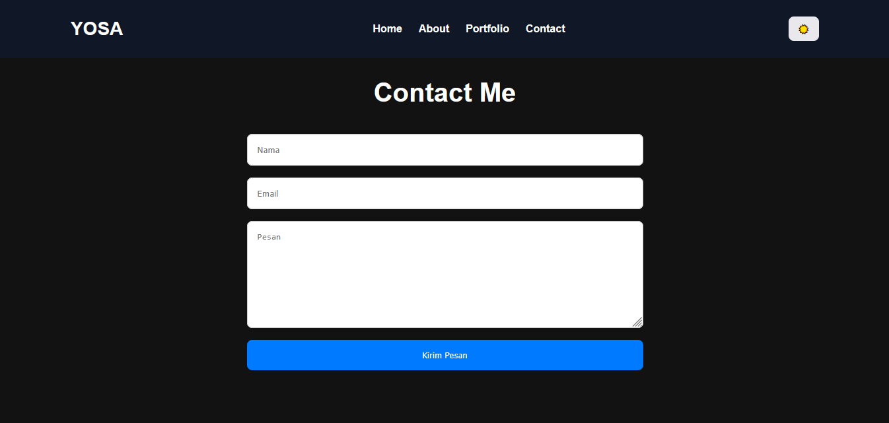
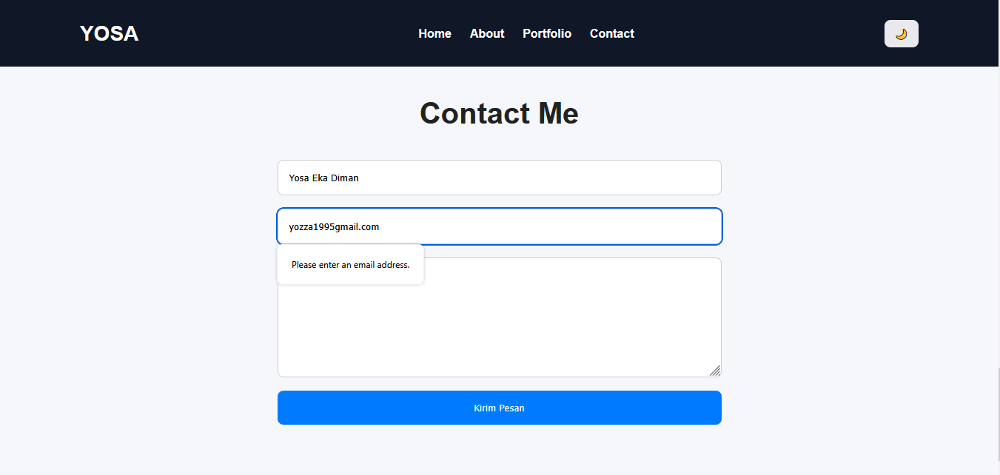
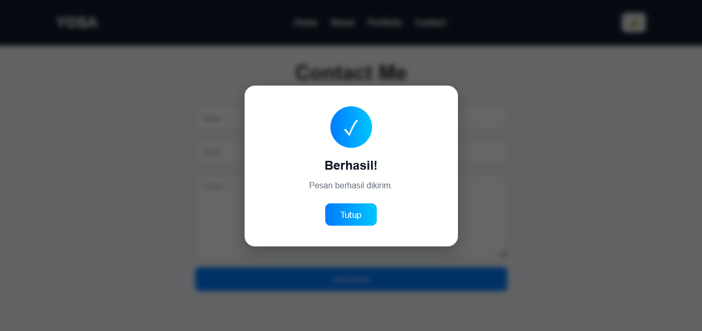

# 🌐 Portfolio Profesional - YOSA

Website portfolio profesional yang dibuat untuk memenuhi tugas UTS Web Development.

## 🚀 Fitur Utama

- Responsive Navigation
- Hero Section Modern
- Dark / Light Mode
- About Me Section
- Skills Progress Bar
- Education Timeline
- Portfolio Gallery
- Filter Portfolio dengan JavaScript
- Lightbox Preview
- Contact Form Validation
- Smooth Scrolling
- Loading Animation
- Responsive Design

---

# 📸 Screenshot Project

## 🖥️ Tampilan Profil Social Media



---

## 🌙 Dark Mode



---

## 📚 About & Timeline



---

## 💼 Portfolio Gallery




---
## 💼 Contact Me



---
## 💼 Validation




---

# 🛠️ Teknologi yang Digunakan

- HTML5
- CSS3
- JavaScript
- Responsive Web Design
- Flexbox & Grid
- Local Storage

---

# 📂 Struktur Project

```text
project-root/
│
├── index.html
│
└── assets/
    ├── css/
    │   └── custom.css
    │
    ├── js/
    │   └── scripts.js
    │
    ├── images/
    │   ├── profile/
    │   ├── projects/
    │   └── bg/
    │
    ├── icons/
    │   ├── social/
    │   └── skills/
    │
    ├── fonts/
    └── docs/
```

---

# ⚙️ Cara Menjalankan Project

## 1. Clone Repository

```bash
git clone https://github.com/username/portfolio-project.git
```

## 2. Masuk ke Folder Project

```bash
cd portfolio-project
```

## 3. Jalankan dengan Live Server

Buka menggunakan:
- VS Code
- Extension Live Server

Klik kanan:

```text
index.html
```

Lalu pilih:

```text
Open with Live Server
```

---

# 🎨 Fitur UI/UX

- Modern Gradient Background
- Hover Animation
- Glassmorphism Effect
- Timeline Education
- Animated Social Icons
- Interactive Portfolio

---

# 📱 Responsive Design

Website telah dioptimasi untuk:
- Desktop
- Tablet
- Mobile

---

# 👨‍💻 Developer

### YOSA EKA DIMAN

Frontend Developer | UI/UX Enthusiast | React Developer

---

# 📄 License

Project ini dibuat untuk keperluan pembelajaran dan tugas UTS.